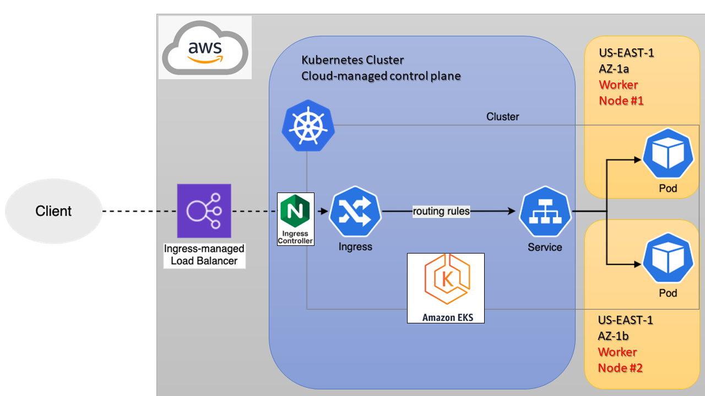

# Recruitment process in Gorilla Logic
## HackerRank
### Author: Enzo Jimenez - enzofjh@gmail.com

<hr>

## Pre-work

Setup AWS CLI profile and credentials with proper permissions.
```sh
aws configure
```
Create Amazon resources on an existing VPC, Subnet, Security Group, Key Pair and IAM Role
```sh
curl https://raw.githubusercontent.com/enzojimenez/proactive-devops-engineer-senior/main/pre-work/aws.sh | bash
```

## GitHub Runners

SSH into the EC2 machines. Setup each of them as a GitHub Runner agent for the infrastructure and application repositories respectively.
```sh
ssh ec2-user@PUBLIC-DNS-NAME -i SSH-PRIVATE-KEY.key
```
From the terminal console, run the following lines:
```sh
curl -o github.sh -L https://raw.githubusercontent.com/enzojimenez/proactive-devops-engineer-senior/main/pre-work/ec2-setup-infra.sh
```
or
```sh
curl -o github.sh -L https://raw.githubusercontent.com/enzojimenez/proactive-devops-engineer-senior/main/pre-work/ec2-setup-app.sh
```
```sh
chmod +x github.sh
```
Use Token generated on GitHub Actions setup
```sh
./github.sh "AINMPAXXXXXXXXXXXXXXXXLDJCZMI"
```

# Acceptance Criteria:

## Architecture diagram demonstrating planned solution.
Diagrams are showned below.
<hr>

## Timeoff-management fork on local repository
* Forked repository _(https://github.com/enzojimenez/timeoff-management-application) is cloned in the GitHub Action agent._
<hr>

## Required infrastructure running on cloud provider of preference, provisioned using some sort of infrastructure as code solution.
* Cloud Provider: _Amazon Web Services_
* Technology: _Kubernetes Cluster (Amazon EKS)_
* Versioning Platform: _GitHub_
* Automation/Pipeline: _GitHub Actions_
* Repository URL: _(https://github.com/enzojimenez/timeoff-management-application-infra)_
* Branch: _main_
* Description: _1x Amazon EC2 instance was provisioned as a GitHub Runner agent with Terraform installed_
* Diagram: 
<hr>

## Application must be deployed using a fully automated continuous integration solution, triggered by a change in source control.
* Technology: _Kubernetes App_
* Versioning Platform: _GitHub_
* Automation/Pipeline: _GitHub Actions + Argo CD_
* Repository URL: _(https://github.com/enzojimenez/timeoff-management-application)_
* Branch: _master_
* Description: _Every Pull Request or merge action that is performed on the default branch will trigger the declared Workflow. In there, the application is tested, containerized (docker) and pushed to Amazon ECR. Finally, a change is made in the repo to update a HELM packeage that later will be picked up by ArgoCD (gitops)._
* Diagram: 
<hr>

## Application must be secured from external access and the application should be serving via standard HTTP and HTTPs protocols.
Setup to comply with this criteria:
<ul>
<li>HTTPS: Cloudflare domain <i>minube.cr</i> with a CNAME record poiting to an Amazon Route53 subdomain zone with the cluster's name:<ul><li><a href="https://timeoff-management.minube.cr/login" target="_blank">https://timeoff-management.minube.cr</a></li></ul></li>
<li>HTTP: Godaddy domain <i>in10minutes.dev</i> with a CNAME record pointing directly to the Amazon NLB's dns record:<ul><li><a href="http://timeoff-management.in10minutes.dev/login" target="_blank">http://timeoff-management.in10minutes.dev</a></li></ul></li>
<li>Description: End-to-end encryption over HTTPS, with a Cloudflare Origin CA certificate on the cluster.</li>
<li>DNS Management [extra]: The external-dns project is running in the cluster for creating DNS records automatically (route53/godaddy)</li>
<li>Diagram: </li>
</ul>
<hr>

## The application should be highly available and load balanced
Resources to comply with this criteria:
<ul>
<li>Amazon EKS automatically manages the performance, availability and scalability of the Kubernetes control plane.</li>
<li>Network Load Balancer in US-EAST-1 region provisioned and owned by the cluster's Nginx Ingress Controller</li>
<li>Two Availability Zones:<ul>
<li>US-EAST-1A</li>
<li>US-EAST-1B</li>
</ul></li>
<li>One EKS Node Group with Two EC2 Instances in each of the Two Subnets/AZs.</li>
<li>Scalability [extra]:<ul>
<li>Application pods are increased/decreased by an HorizontalPodAutoscaler CPU metric (+80%) with 2 minimum and 6 maximum pods. The two minimum pods are running on each Worker Node.</li>
<li>The EC2 Worker Nodes are also controlled by an EC2 AutoScaling min/max definition.</li>
</ul>
<li>Diagram: </li>
</ul>